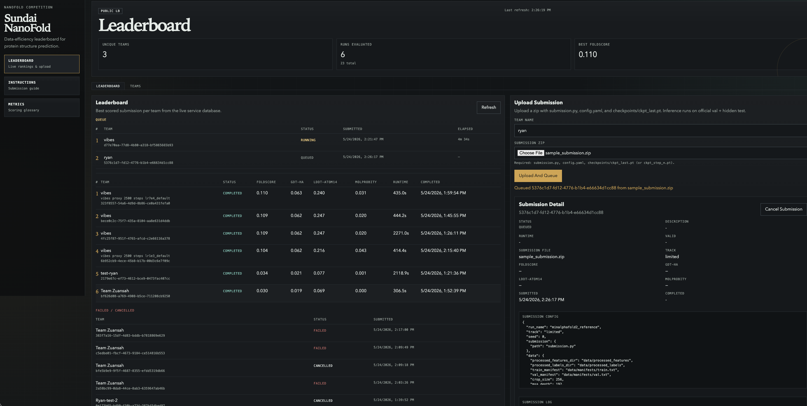

# Sundai NanoFold Bench

`sundai-nanofold-bench` runs the local leaderboard service for the Sundai nanoFold competition. It provides the FastAPI service, static leaderboard UI, upload flow, in-process nanoFold evaluator, status tracking, and SQLite score persistence.

<p align="center">
  
</p>

## Data Source

Competition data, manifests, preprocessing scripts, and participant training instructions live in the official nanoFold competition repository:

https://github.com/ChrisHayduk/nanoFold-Competition/tree/main

Downloading and preprocessing the official data can take hours. Reuse an existing prepared local checkout when available.

## Quick Start

```bash
uv sync
export NANOFOLD_REPO=/path/to/nanoFold-Competition
uv run uvicorn service.app:app --host 0.0.0.0 --port 8888
```

Open `http://localhost:8888` or the exposed RunPod port URL.

The service defaults to `service/leaderboard.db`. For production or shared deployments, set `SUNDAI_DB_PATH` to a persistent path outside the repo.

## Submission Contract

Upload a zip containing these files at the archive root:

```text
config.yaml
submission.py
checkpoints/
  ckpt_last.pt
```

`checkpoints/ckpt_step_*.pt` is also accepted. The evaluator uses the highest numbered step checkpoint, falling back to `ckpt_last.pt`.

Submissions must follow the model, optimizer, and batch API documented in the nanoFold competition repo, including `build_model`, `build_optimizer`, and `run_batch`.

## Repository Layout

- `service/`: FastAPI service, evaluator, schema, logging utilities
- `service/web/`: static leaderboard, upload form, instructions, metrics page
- `sdk/`: lightweight API/data helpers
- `docker/`: API Dockerfile and startup script
- `docs/`: architecture, deployment, handoff, schema, and submission details

## Runtime State

Keep runtime artifacts and competition data out of version control. This includes the live database, logs, uploads, checkpoints, generated bundles, and any downloaded datasets.

The repository includes a sanitized, schema-only example database at `service/leaderboard.example.db` for bootstrap and schema inspection. The live database at `service/leaderboard.db` should remain untracked.
